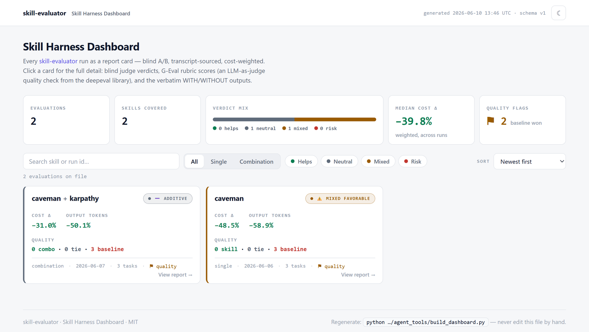
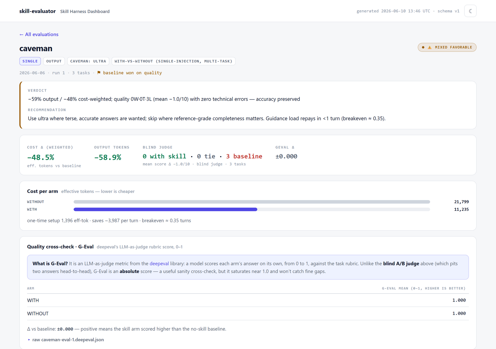
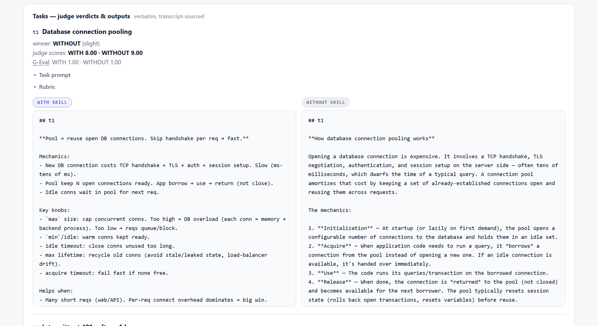
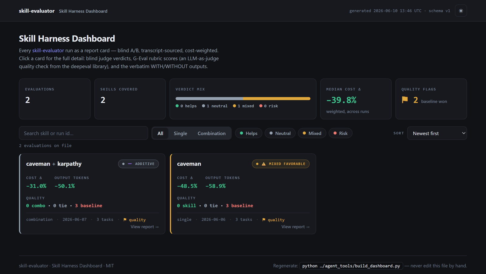

# The Skill Harness Dashboard

One static page that shows **every evaluation in `reports/` as a report card**,
so a team can govern its skill harness — see at a glance what helps, what hurts,
what conflicts when stacked, and decide per skill: **adopt, reject, or re-run**.

Open [`../reports/dashboard.html`](../reports/dashboard.html) in any browser.
It is a single self-contained file — no server, no build step, no CDN, no
JavaScript dependencies — so it works from `file://`, inside an air-gapped
environment, and in CI artifacts. The copy tracked in this repo is a live demo
built from the two real example runs.

This document covers the design (why JSON, not Markdown parsing or HTML
reports), the summary schema, the builder CLI, the UI, and the governance
workflows the dashboard enables.

## Why it exists

A single evaluation report answers "does *this* skill help?". Governance asks a
different question: "across **all** the skills we've measured, which earn their
context, which regress quality, and which fight each other when combined?"
Reading ten Markdown reports to answer that doesn't scale, and nothing
aggregates them. The dashboard is that aggregate — the decision surface over the
whole `reports/` directory, kept current automatically by the workflow's
Phase 7.

## Design: three layers, one source of truth

The user-facing question behind this feature was: *should reports be written in
HTML? Should the pipeline parse the Markdown into HTML? Or output JSON and
render HTML from that?* The answer implemented here is the third, and it's
worth recording why:

- **Markdown reports stay Markdown — and are never parsed.** They are the
  human/audit layer: rendered by GitHub, readable in any editor, diffable in
  code review, greppable. Authoring them in HTML would destroy all of that, and
  *parsing* them (regexing tables and headlines out of prose) is exactly the
  brittle path this design avoids — a wording tweak in a template would
  silently corrupt the dashboard.
- **JSON is the canonical machine layer.** At the moment the workflow writes
  the report (Phase 7) it also writes
  `reports/<name>-eval-<n>.summary.json` — the same numbers, from the same
  transcript-sourced artifacts, in a small **versioned schema**. No parsing
  step exists anywhere; the data is born structured.
- **HTML is generated presentation.** `build_dashboard.py` validates every
  summary and renders `reports/dashboard.html` from the bundled template,
  **embedding** the JSON into the file. That makes the page openable from
  `file://` (browsers block `fetch()` of local JSON), trivially shareable, and
  dependency-free. It also writes `reports/index.json` — the same data,
  un-embedded — for CI gates and your own tooling.

```
evaluation run (SKILL.md Phases 0–6)
        │
        ├── reports/<name>-eval-<n>.md, -records.md, .deepeval.*     ← human / audit
        │
        └── Phase 7 ──► reports/<name>-eval-<n>.summary.json         ← DATA LAYER
                                 │                                      (schema v1,
                                 ▼                                       validated)
                  agent_tools/build_dashboard.py
                                 │
                 ┌───────────────┴────────────────┐
                 ▼                                ▼
        reports/index.json               reports/dashboard.html
        (for CI / scripts / trends)      (self-contained governance page)
```

Two invariants make the pipeline trustworthy:

1. **The summary is a projection of the report, never a second computation.**
   Every number in a summary must equal a figure already in the report or its
   JSON artifacts (`*.interaction.json`, `*.judge.verdicts.json`,
   `*.deepeval.json` — all transcript-sourced). Nothing is re-derived or
   estimated; anything unmeasured is omitted (or `"available": false`), exactly
   as the report marks it `unmeasured`.
2. **Generated outputs are never hand-edited.** `index.json` and
   `dashboard.html` are build products of `build_dashboard.py`; regenerate
   them, don't patch them.

## The summary schema (`schema_version: 1`)

One JSON object per evaluation run, at
`reports/<name>-eval-<n>.summary.json` (combination:
`reports/<combo>-combo-eval-<n>.summary.json`). The normative, always-current
reference is the docstring of
[`build_dashboard.py`](../skills/skill-evaluator/agent_tools/build_dashboard.py);
the two tracked examples
([`caveman-eval-1.summary.json`](../reports/caveman-eval-1.summary.json) and
[`caveman+karpathy-combo-eval-1.summary.json`](../reports/caveman+karpathy-combo-eval-1.summary.json))
are complete, real instances of both kinds.

### Field reference

| Field | Req | Type / values | Meaning |
|-------|-----|---------------|---------|
| `schema_version` | ✔ | int (`1`) | Schema this summary conforms to. |
| `id` | ✔ | string | Unique run id — use the report basename. |
| `kind` | ✔ | `"single"` \| `"combination"` | Evaluation mode. |
| `skills` | ✔ | list of `{name, mode?, mechanism?}` | The evaluated skill(s); ≥ 2 entries for `combination`. |
| `design` | – | string | e.g. `"with-vs-without (single-injection, multi-task)"`, `"factorial-2"`. |
| `run`, `tasks` | – | int | Run number; number of tasks. |
| `date` | rec. | `"YYYY-MM-DD"` | Drives "newest first" sorting. |
| `verdict.label` | ✔ | string | Drives the card color (see buckets below). |
| `verdict.emoji` | – | string | Shown on the stamp (defaults per bucket). |
| `verdict.headline` | rec. | string | The report's one-line joint token+quality verdict. |
| `verdict.bottom_line` | – | string | The report's actionable "Bottom line". |
| `metrics.mechanism` | rec. | string | `output` \| `context` \| `round-trips` \| `none` \| `behavioral` \| `mixed`. |
| `metrics.headline.cost_delta_pct` | rec. | number | Cost-weighted Δ% vs baseline. **Negative = cheaper.** |
| `metrics.headline.primary_delta_pct` | – | number | Δ% on the skill's billing axis; omit for mechanism `none` → the card shows "no token claim". |
| `metrics.arms` | ✔ | list (≥ 2) of `{name, skills, cost_units?, output_tokens?, …}` | One entry per arm/subset; `cost_units` are the cost-weighted effective tokens. ≥ 1 arm must carry a numeric `cost_units`. |
| `metrics.setup` | – | `{one_time_cost_units, per_turn_saving_cost_units, breakeven_turns}` | One-time vs recurring split. |
| `interaction` | rec. (combination) | object | From `interaction_effects.py`: `classification`, `value` (excess over additive), `combined_savings`, `additive_prediction`, `individual_effects`, `marginal_effects`, `best_single`, `best_single_savings`. `"available": false` + `reason` for combined-vs-baseline designs. |
| `quality.pairwise` | rec. (single) | `{comparison, wins, ties, losses, mean_delta}` | The blind judge's WITH-vs-WITHOUT tally. |
| `quality.combo_vs_none` / `quality.combo_vs_best_single` | rec. (combination) | `{wins, ties, losses, best_single?}` | The two decisive combination comparisons. |
| `quality.deepeval` | – | `{available, arm_means, delta_vs_baseline}` | GEval cross-check; `available: false` when skipped. |
| `per_task` | – | list | Rendered in the card's Details panel; see the docstring for the per-kind shapes. |
| `caveats` | – | list of strings | First two render as chips; all in Details. |
| `files` | – | map of label → path | Relative to `reports/`; rendered as artifact links (`report`, `records`, `deepeval_md`, `interaction_md`, `judge_verdicts_md`, …). |

Sign convention everywhere: deltas are **(arm − baseline)**, so a saving is
negative. The dashboard colors negative cost deltas green.

### Verdict buckets

`verdict.label` is free text, bucketed by prefix into the four card colors:

| Bucket | Labels (prefix match) | Card |
|--------|----------------------|------|
| good | `helps`, `synergistic`, `synergy` | green |
| neutral | `additive`, `none`, `no-effect`, `no-token-claim` | grey |
| warn | `mixed`, `mixed-favorable`, `mixed-unfavorable`, `redundant`, `sub-additive` | amber |
| bad | `conflicting`, `antagonistic`, `hurts`, `costs-more`, `regression` | red |

Unknown labels fall back to neutral, so a new classification never breaks the
page.

### Validation rules

`build_dashboard.py` distinguishes **errors** (the summary is skipped and the
build exits 4 — CI fails) from **warnings** (printed, summary still rendered):

- **Errors:** `schema_version` missing/non-int · `id` missing · `kind` not
  `single`/`combination` · `skills` empty or malformed (or < 2 for a
  combination) · `verdict.label` missing · `metrics.arms` missing/< 2 entries ·
  no arm with a numeric `cost_units`.
- **Warnings:** newer `schema_version` than the builder (rendered best-effort) ·
  missing `date`, `quality`, `verdict.headline`, or
  `metrics.headline.cost_delta_pct` · a combination without an `interaction`
  block · an arm without `cost_units` (rendered "unmeasured") · duplicate `id`s.

### Evolution policy

Adding **optional** fields is non-breaking — the dashboard ignores keys it
doesn't know, and `index.json` carries them through for your tooling. A
**breaking** change (renaming/removing a field, changing a meaning) bumps
`schema_version`; the builder warns on versions newer than its own and renders
best-effort rather than refusing.

## `build_dashboard.py` — CLI reference

Standalone, **standard-library only** (like `transcript_tokens.py`); runs
offline on Python ≥ 3.9.

```bash
# from the repo root — scan reports/, write index.json + dashboard.html:
python skills/skill-evaluator/agent_tools/build_dashboard.py

# validate only (CI mode) — write nothing:
python skills/skill-evaluator/agent_tools/build_dashboard.py --check

# non-default locations:
python .../build_dashboard.py --reports path/to/reports
python .../build_dashboard.py --out reports/dashboard.html
python .../build_dashboard.py --template path/to/dashboard.html
python .../build_dashboard.py --quiet          # only print problems
```

| Flag | Default | Meaning |
|------|---------|---------|
| `--reports DIR` | `reports/` | Directory scanned for `*.summary.json`. |
| `--out PATH` | `<reports>/dashboard.html` | Dashboard output; `index.json` is written next to it. |
| `--template PATH` | bundled `templates/dashboard.html` | Resolved relative to the script, so it works wherever the skill is installed. |
| `--check` | off | Validate only; write nothing. |
| `--no-artifacts` | off | Don't embed the sibling JSON artifacts that power the detail views (smaller `dashboard.html`; detail pages link to the Markdown instead). |
| `--quiet` | off | Suppress the per-run listing. |

Exit codes: **0** all summaries valid · **2** reports dir or template missing ·
**4** at least one invalid summary (valid ones are still rendered; treat 4 as a
CI failure). The repo's CI runs `--check` on the tracked example summaries on
every push, on Python 3.9 and 3.13.

`index.json` shape (the embedded payload is the same object **plus a
per-run `_detail` key** carrying the artifact JSON for the detail views —
`index.json` itself never includes `_detail`):

```json
{
  "schema_version": 1,
  "generated_at": "2026-06-10 05:30 UTC",
  "generator": "skill-evaluator/build_dashboard.py",
  "count": 2,
  "runs": [ { "...": "each valid summary, newest first" } ]
}
```

## The UI

The whole page is the screenshot below — masthead, KPI strip, toolbar, and the
card grid. Each card is a clickable link into its own detail page.

[](../reports/dashboard.html)

**Masthead & KPI strip.** Generation timestamp + schema version; then the
portfolio at a glance — evaluations on file, distinct skills covered, the
**verdict mix** as a proportional color bar with per-bucket counts, the
**median cost-weighted Δ** across runs, and the **quality flags** count.

> **The ⚑ quality flag.** A run is flagged when the **baseline beat the
> skill(s)** on the decisive blind-judge comparison — for a single skill,
> `pairwise` losses > wins; for a combination, `combo_vs_none` losses > wins.
> It deliberately ignores the token numbers: a token win with a quality loss is
> the regression this harness exists to catch, and the flag keeps it visible
> even on a green-looking card.

**Toolbar.** Free-text search (run id + skill names), mode chips
(All / Single / Combination), four multi-select verdict-bucket filters (none
selected = show all), and sorting: newest first · biggest cost savings (most
negative `cost_delta_pct` first) · best quality delta (deepeval Δ, falling back
to the judge's mean delta, then W−L ratio) · name A→Z.

**Cards (the list).** Each evaluation is one compact, **clickable** card —
the whole card is a link into its detail page:

- a verdict-colored left edge plus the flat **verdict badge** (status dot +
  `verdict.label` + emoji);
- the skill name(s) (`a + b` for combinations);
- the three numbers that matter — cost-weighted Δ%, the primary-axis Δ% on the
  skill's billing mechanism (or *no token claim*), and the decisive quality
  W·T·L;
- a meta line: kind · date · task count · the ⚑ flag · "View report →".

Everything else lives in the detail page, keeping the list scannable.

[](../reports/dashboard.html)

**The detail page (click a card).** Routing is in-page via the URL hash
(`#run/<id>`), so the browser's back button works and a detail page can be
deep-linked or bookmarked — still one static file, no server. It shows the
full record for the run:

- the report's **verdict** and **recommendation**, and a stat row (cost Δ,
  primary Δ, the decisive judge tallies, GEval Δ);
- **Cost per arm** bars (baseline grey, singles mid-tone, full stack accent;
  `unmeasured` arms say so) with the setup / per-turn saving / breakeven note;
- **Interaction** (combinations): the excess-over-additive line plus the full
  decomposition table — or the explicit "not decomposed" notice for
  combined-vs-baseline designs;
- **deepeval (GEval)**: per-arm means, the Δ-vs-baseline, and the raw
  `<id>.deepeval.json` in a collapsible when embedded;
- **Tasks — judge verdicts & outputs**: per task, the judge winner/margin and
  scores (combinations also show the best single and combo-vs-best), the
  per-task GEval, the task prompt and rubric in collapsibles, and — the core
  of the page — the **verbatim WITH vs WITHOUT outputs side by side**
  (combinations: combo vs base, with the single-skill arms in a collapsible).
  The text comes from the run's `<id>.deepeval.cases.json`, which the builder
  embeds at build time (see below); the raw judge-verdicts JSON appears in a
  collapsible when present;
- **Caveats** in full, and **Artifacts** — links to the Markdown report,
  records, deepeval, interaction, and judge-verdict files (relative paths —
  they open locally and on GitHub).

[](../reports/dashboard.html)

<sub>The core of the detail page: read **WITH** (left) against **WITHOUT**
(right) and judge the difference yourself. The text is the verbatim transcript
output, with the blind judge's verdict sitting directly above each pair.</sub>

**Where the verbatim outputs come from.** The builder embeds each run's
sibling JSON artifacts (`<id>.deepeval.cases.json`, `<id>.deepeval.json`,
`<id>.interaction.json`, `<id>.judge.verdicts.json`, or the paths in `files`)
into the dashboard payload — these are existing, transcript-sourced
deliverables, so the no-Markdown-parsing rule still holds, and `index.json`
stays summaries-only. If a cases file is missing (or `--no-artifacts` was
passed, or it exceeds the embed size cap), the detail page says so and links
to the records companion instead — it never invents output text.

**Theme & print.** A plain, flat light theme by default — neutral surfaces,
one accent, tabular numerals, no ornament or animation — with a matching dark
theme via the toggle (persisted in `localStorage`, honoring
`prefers-color-scheme` initially), plus a print stylesheet that drops the
chrome, expands the output panes, and keeps cards unbroken — print a detail
page for a review meeting. Filter chips expose `aria-pressed`; focus states
are visible.

[](../reports/dashboard.html)

<sub>The dark theme — toggle with the ☾/☀ button in the masthead.</sub>

## Governance workflows

**Review heuristics** — what each verdict bucket usually means for the
portfolio decision:

| Card | Typical call |
|------|--------------|
| ✅ helps / synergistic, no ⚑ | Adopt; for a combination, ship the stack. |
| ➖ additive / no-effect | Adopt for the token economics alone (additive combo) or drop the skill (no effect) — it isn't earning its context. |
| ⚠️ mixed / redundant | Read the caveats + per-task table: a *mixed-favorable* with zero technical errors may be fine where terseness is wanted; *redundant* means keep only the strongest skill of the stack. |
| ❌ conflicting / costs-more / hurts | Reject or fix; for a combination, un-stack and re-run. |
| any card with ⚑ | The baseline won on quality — re-read the records companion before adopting, and re-run with more tasks if it's a borderline single-boundary miss. |

Small-N applies to every cell above: the dashboard surfaces the joint verdict,
the report + records remain the evidence.

**CI gate.** `index.json` makes a regression gate a few lines — fail the build
when any run lands in a bad bucket:

```yaml
- name: Gate on skill-evaluator verdicts
  run: |
    python - <<'PY'
    import json, sys
    BAD = ("conflicting", "antagonistic", "costs-more", "hurts", "regression")
    index = json.load(open("reports/index.json", encoding="utf-8"))
    bad = [r["id"] for r in index["runs"]
           if str(r.get("verdict", {}).get("label", "")).lower().startswith(BAD)]
    if bad:
        print("regressing evaluation runs:", ", ".join(bad))
        sys.exit(1)
    print(f"all {index['count']} runs clear")
    PY
```

(Re-run `build_dashboard.py` first if summaries may have changed; the repo's own
CI already runs `--check` to keep the data layer valid.)

**Keeping it current.** Phase 7 of the skill refreshes the dashboard after
every evaluation. Regenerating updates the `generated_at` stamp inside
`index.json` and `dashboard.html`, so in a repo that tracks the demo files,
commit those two only when you mean to update the published demo.

## Backfilling runs that predate the dashboard

Older evaluations have a report but no `.summary.json`. Don't re-run them — ask
the skill in chat:

> Backfill `reports/<name>-eval-<n>.summary.json` from its report and
> artifacts, then rebuild the dashboard.

It projects the existing report's numbers (and its `*.interaction.json` /
`*.judge.verdicts.json` / `*.deepeval.json` artifacts) into the schema — the
same hard rule applies: a projection, never a re-measurement — then runs
`build_dashboard.py`. The two tracked example summaries in this repo were
produced exactly this way from the two tracked example reports.

## Troubleshooting

- **The page shows "The data layer is empty".** Either no `*.summary.json`
  exists in the reports dir yet (run an evaluation, or backfill), or you opened
  `templates/dashboard.html` directly — that file is the **template** with no
  data injected; open `reports/dashboard.html`, the built output.
- **`error: reports directory not found`** — run from the repo root, or pass
  `--reports path/to/reports`.
- **`error: dashboard template not found`** — the script resolves the template
  relative to itself (`../templates/dashboard.html`); if you've vendored the
  script elsewhere, pass `--template`.
- **`exit 4` / "skipped (fix the summary…)"** — a summary failed validation;
  the stderr lines name the file and the exact field. Fix the summary (the
  schema is in the script's docstring), never the validator.
- **A run is missing from the page** — its summary was invalid (see above), or
  its filename doesn't end in `.summary.json`.
- **Garbled characters in the console on Windows** — the script reconfigures
  stdout/stderr to UTF-8 where possible; on very old terminals set
  `PYTHONIOENCODING=utf-8`. The HTML itself is always UTF-8 and unaffected.
- **A detail page says "Verbatim outputs aren't embedded"** — no
  `<id>.deepeval.cases.json` sat next to the summary at build time (or the
  build ran with `--no-artifacts`, or the file exceeded the embed cap). Keep
  the deepeval deliverables in `reports/` and rebuild; the page links to the
  records companion in the meantime.
- **An arm shows "unmeasured"** — its `cost_units` is absent in the summary,
  mirroring an `unmeasured` arm in the report. That's by design: the dashboard
  never invents a number.
